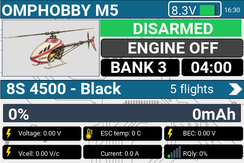
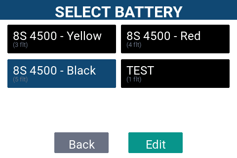
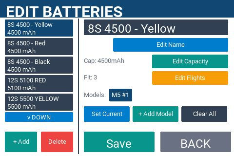

# SSODB---Rotorflight-dashboard
Dashboard and battery manager for Rotor flight
This is a Battery manager / dashboard for EdgeTX to be used with Rotorflight telemetry.

## == PREREQUISITES ==

* **Radio OS:** EdgeTX v2.8 or newer with Touchscreen support (480x320 resolution , e.g., RadioMaster TX15 - no other resolution has been tested).
* **Flight Controller:** Rotorflight 2.0+ with active telemetry enabled (CRSF/ELRS or S.Port).
* **RFTOOLS lua needs to be installed and active on another screen of EdgeTX -- The model name is taken from this lua-script.

## == FEATURES ==
This widget has 3 screens:
- Flight information screen (main screen)
	- Timer
	- Battery name (press to enter the battery select screen)
	- Battery bar
	- Headspeed / Throttle mode (on - idle - off)
	- Bank
	- Armed / disarmed
	- Telemetry
 

   
- Battery select screen
	- Pops up when connecting model
	- A Battery can be assigned to multiple models.
	- Rotorflight Integration: Each battery is assigned a model-specific profile number (1–6) that corresponds directly to Rotorflight's battery profiles.
	  Upon selection, this index is scaled to -1024 / +1024. This scaled value is written to an EdgeTX Global Variable (GV), which can be used in inputs or mixes, allowing Rotorflight to automatically sync and load the matching battery profile.
   	- Enter the battery edit screen by pressing the edit button

   
- Battery edit screen
	- Allows creating, editing, deleting batteries
	- Input battery name
	- Input battery capacity (not used for calculations)
	- Input battery
	- Allows assigning batteries to models
	- For a new battery, the widget automatically assigns a model specific profile number so no duplicates are possible.

- Post-flight screen
	- Pops up when disconnecting model
	- Gives summary of most important telemetry values
		- Flight Time
		- Max ESC temperature
		- Max ESC current
		- Min cell voltage, etc
	- Closes automatically after 5 minutes
	- Closes automatically when a model is connected

The widget uses a .bmp background for the flight screen. This avoids drawing multiple rectangles over top of the background.

Includes: 
- Flight counter per battery 

	

## == INSTALLATION & SETUP==
SEE THE INSTALLATION GUIDE INCLUDED.
